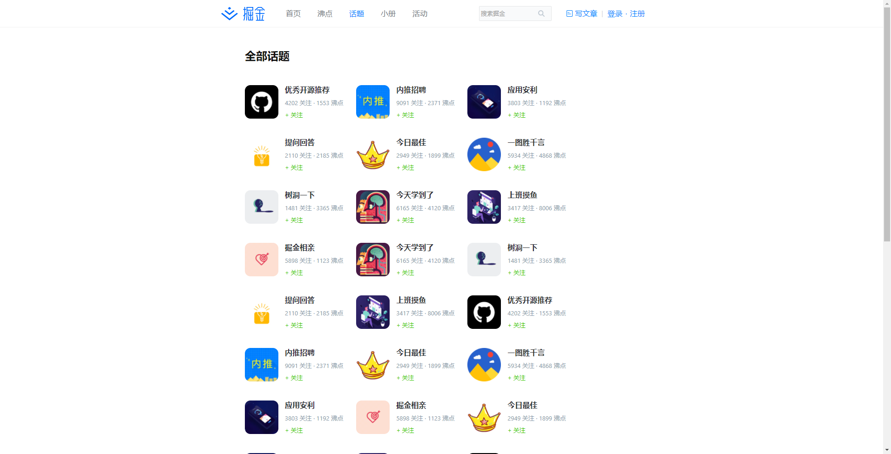

## 项目运行

```

安装依赖
yarn install

-------------------------

启动两个终端：
第一终端 - 启动react
yarn start

第二终端 - 启动express服务
yarn server

-------------------------

或者同时启用两个终端：
yarn dev

```

### 简介

本项目是一个仿写掘金PC端网站项目。

本项目使用 express 作为服务端，数据使用的是假数据，所以这是一个纯前端项目。

关于用户登录、注册，使用的浏览器的索引数据（IndexDB）来增删改查数据。

如有问题，请联系QQ``122874722``。

### 项目使用技术栈

本项目使用到的技术栈如下：
* React全家桶

## 加入项目

如果想加入本项目的开发，需将项目fork到自己的仓库下，功能开发完成后，提PR即可。
  
### 项目效果图





## 写在最后

* 本项目仅用于学习使用，切勿用于商业用途，否则产生的法律后果与作者无关。
